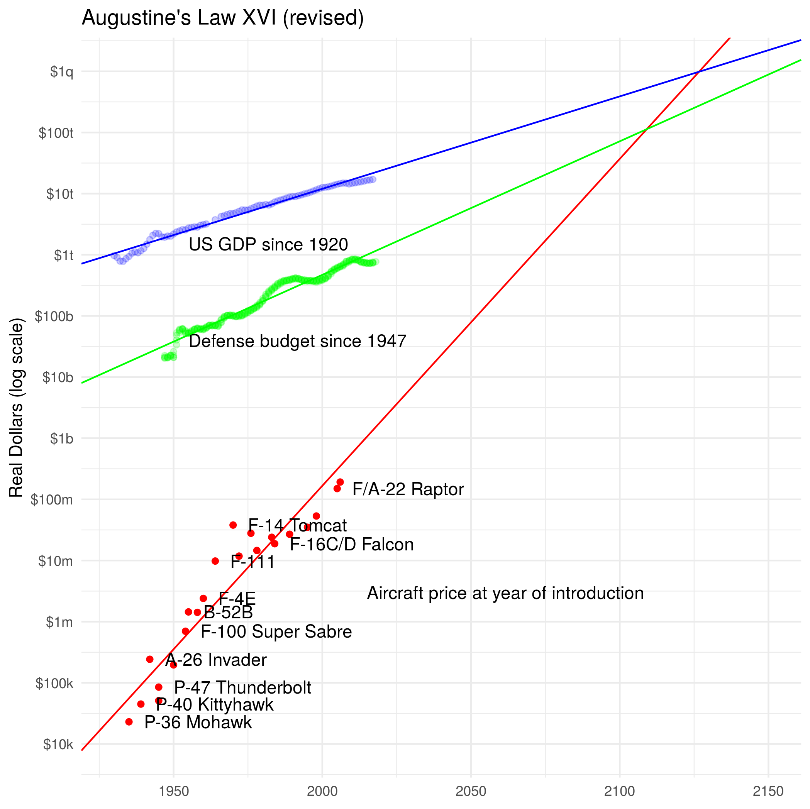

Augustine's 16th Law
===

[Augustine's Laws](https://en.wikipedia.org/wiki/Augustine%27s_laws)
are a collection of tips from a decades of government contracting.
One of them observed that the price of fighter aircraft was growing
faster than the US defense budget:

> Law Number XVI: In the year 2054, the entire defense budget will
> purchase just one aircraft. This aircraft will have to be shared by
> the Air Force and Navy 3-1/2 days each per week except for leap year,
> when it will be made available to the Marines for the extra day.

This R script attempts to verify this law.

* [FDEX](https://fred.stlouisfed.org/series/FDEFX)
* [GDP](https://fred.stlouisfed.org/series/GDP)
* [Combat aircraft prices](https://en.wikipedia.org/wiki/File:Augustine%27s_law.svg)

